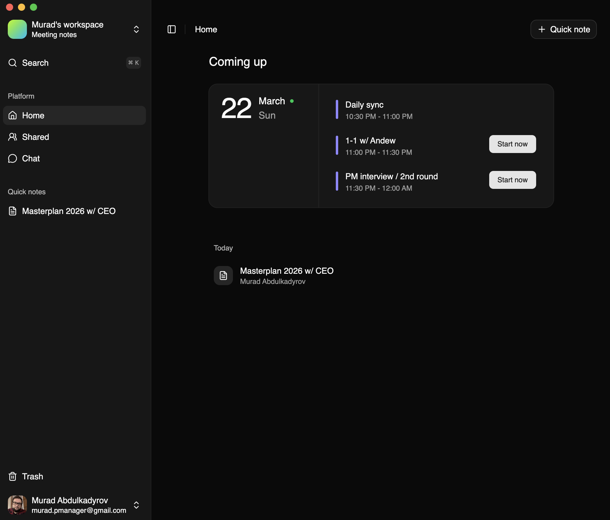

<a href="https://opengran-oss.vercel.app">
  
  <h1 align="center">OpenGran</h1>
</a>

<p align="center">
  Open-source Granola-like Notepad Built with Vite, Electron, AI SDK, and Convex.
</p>

<p align="center">
  <a href="#features"><strong>Features</strong></a> ·
  <a href="#built-with"><strong>Built with</strong></a> ·
  <a href="#apps"><strong>Apps</strong></a> ·
  <a href="#model-providers"><strong>Model providers</strong></a> ·
  <a href="#deploy-your-own"><strong>Deploy your own</strong></a> ·
  <a href="#running-locally"><strong>Running locally</strong></a>
</p>
<br/>

## Features

- Live meeting transcription
- AI-powered note refinement
- Custom note templates
- Workspace organization
- Desktop meeting workflow
- Calendar-aware setup
- Browser extension integration

## Built with

- [Vite](https://vite.dev/)
  - Fast local development and production builds for the shared OpenGran renderer
- [Electron](https://www.electronjs.org/)
  - Desktop shell for native windowing, tray support, and packaged app distribution
- [AI SDK](https://sdk.vercel.ai/docs)
  - Text generation, streaming responses, and AI-assisted note workflows
- [OpenAI](https://openai.com/)
  - Default provider for chat, note enhancement, and transcription APIs
- [Convex](https://www.convex.dev/)
  - Realtime backend for auth, data sync, queries, mutations, and HTTP routes
- [Better Auth](https://www.better-auth.com/)
  - Authentication with GitHub and Google provider support
- [Tiptap](https://tiptap.dev/)
  - Rich-text editing for note composition and template-driven rewriting
- [Shadcn/UI](https://ui.shadcn.com)
  - UI primitives built on [Radix UI](https://radix-ui.com) and [Tailwind CSS](https://tailwindcss.com)

## Apps

- `apps/web`
  - Browser app and shared renderer
- `apps/desktop`
  - Electron desktop app for native transcription and packaged releases
- `apps/extension`
  - Browser extension for in-browser meeting detection and desktop integration

## Model providers

OpenGran ships with [OpenAI](https://openai.com/) as the default provider. Because the app uses the [AI SDK](https://sdk.vercel.ai/docs), you can adapt it to other providers such as [Anthropic](https://anthropic.com), [Ollama](https://ollama.com), [Cohere](https://cohere.com/), and [other supported providers](https://sdk.vercel.ai/providers/ai-sdk-providers).

## Deploy your own

You can deploy your own version of OpenGran to Vercel with one click:

[](https://vercel.com/new/clone?repository-url=https%3A%2F%2Fgithub.com%2Fmurabcd%2Fopengran&env=VITE_CONVEX_URL,VITE_CONVEX_SITE_URL,CONVEX_SITE_URL,OPENAI_API_KEY,SITE_URL,BETTER_AUTH_SECRET&envDescription=Set%20the%20Convex%20URLs%2C%20OpenAI%20API%20key%2C%20site%20URL%2C%20and%20Better%20Auth%20secret%20for%20your%20deployment.&envLink=https%3A%2F%2Fgithub.com%2Fmurabcd%2Fopengran%2Fblob%2Fmain%2F.env.example&demo-title=OpenGran&demo-description=Open-source%20Granola-like%20Notepad%20Built%20with%20Vite%2C%20Electron%2C%20AI%20SDK%2C%20and%20Convex.&demo-url=https%3A%2F%2Fopengran-oss.vercel.app)

Optional provider setup:

- `GITHUB_CLIENT_ID` and `GITHUB_CLIENT_SECRET` for GitHub sign-in
- `GOOGLE_CLIENT_ID` and `GOOGLE_CLIENT_SECRET` for Google sign-in and calendar access

## Running locally

You will need the environment variables [defined in `.env.example`](.env.example) to run OpenGran. It is recommended to use [Vercel Environment Variables](https://vercel.com/docs/projects/environment-variables), but a local `.env` file is enough for development.

> Do not commit your `.env` file. It contains secrets that can expose your AI provider and authentication accounts.

```bash
bun install
bun dev
```

Your app should then be available on [localhost:3000](http://localhost:3000/).

On macOS, `bun dev` launches an unpacked `OpenGran.app` wired to the local renderer so native permissions and desktop bundle behavior stay close to production.

If you only want the browser app, run `bun run dev:web`.

## Versioning and releases

This repo uses Changesets for versioning.

```bash
bun changeset
```

Use `patch` for smaller desktop updates and `minor` for larger feature milestones.

When you are ready to ship:

```bash
bun run release:prepare
git add .
git commit -m "version packages"
git push origin main
```

GitHub Actions handles CI, matching tag creation, and desktop release publishing after the version bump lands on `main`.
